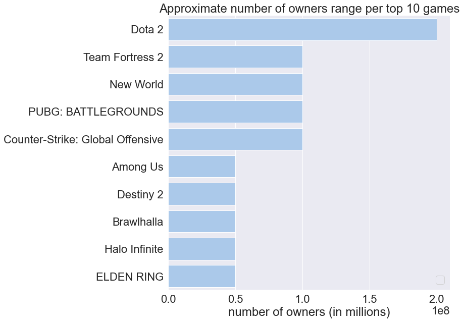
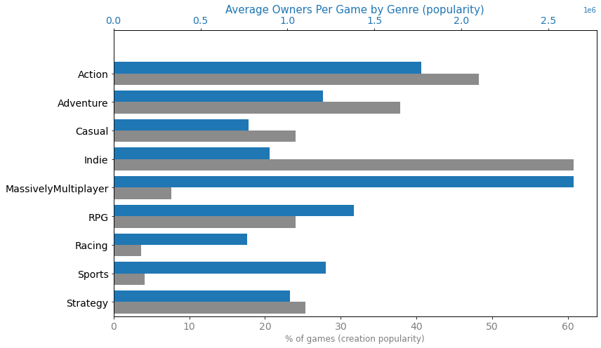
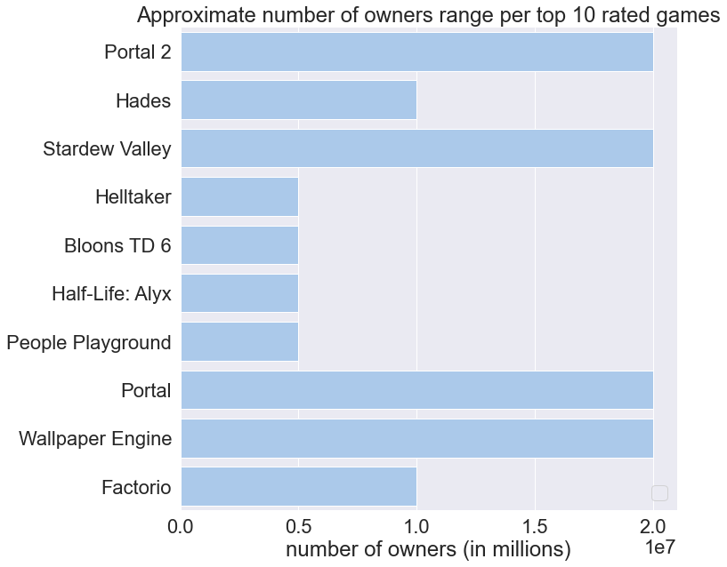
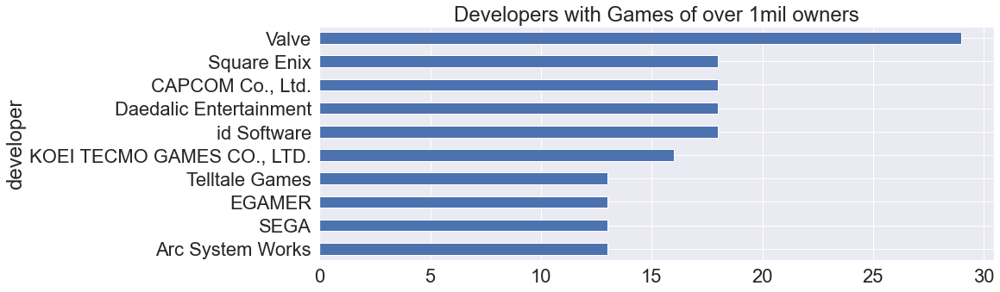
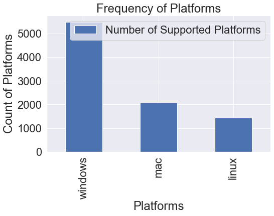
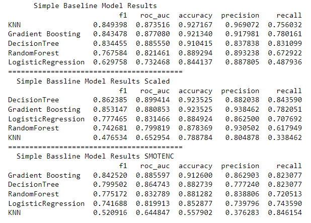
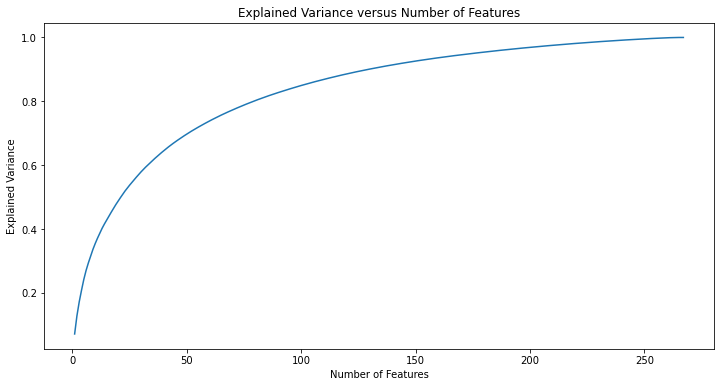
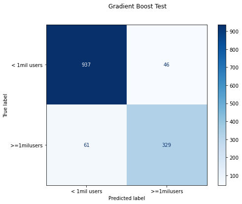
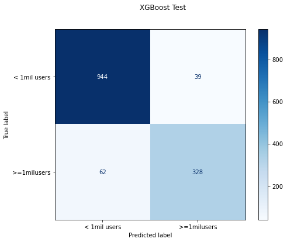

# Steam Games Analysis
Myrna Grace Calip

## Introduction

The video-game industry are a billion-dollar business that provided a positive influence and growth in revenue through out the COVID-19 pandemic. Throughout the decades, its rise in popularity has grown with more than 2.7 billion players worldwide. Despite video games having a reputation as a hobby the industry has grown to become a profession to many gaming communities such as Esports, Twitch streamers, and YouTube gaming channels to share their experiences worldwide. 

## Overview

Steam is a widely known video game distribution platform that offers over 50,000 games to over 120 million active steam users as of 2020. The platform provides game creators and publishers to release games for all users who are looking to play casually or competitively. The data extracted by SteamSpy and the Steam App will help our understanding on released games that are currently available on Steam.

- Steam is the world’s largest distributor of PC games, taking up 75% of the global market share. 
- Steam supports 29 languages. 
- Steam Link/Deck - portable game play
- Supports all 3 platforms

## Business Problem

The goal of our analysis is to provide to game developers and publishers insights using classification and machine learning algorithms to determine which game features and statistics on Steam influences high user count. Our data and knowledge will help present suggestions to publishers on games to consider developing based on the predicted results and analysis that will set their game for success.

## Project Overview

### Our Data

The data is extracted in March 2021 using get request from SteamSpy and Steam App Store's API. Special thanks to [Nik Davis Blog Post](https://nik-davis.github.io/posts/2019/steam-data-collection/) for the detailed explaination on how to extract data straight from  SteamSpy and Steam App Store's API and his [Kaggle Dataset](https://www.kaggle.com/datasets/nikdavis/steam-store-raw). 

**Provided Data**
- 6,000 Steam Games

I gathered our data from three sources:
- [SteamSpy](https://steamspy.com/api.php) Steam Spy automatically gathers data from Steam user profiles, analyzes it
- [SteamWorks](https://partner.steamgames.com/)
- [SteamStoreFrontQpi](https://wiki.teamfortress.com/wiki/User:RJackson/StorefrontAPI)
- [Kaggle Dataset](https://www.kaggle.com/datasets/nikdavis/steam-store-raw)

**Data Cleaning/Preprocessing**
- During our extraction some of our textual data were in different languages so I downloaded the Kaggle dataset which had the same relevant information then joined and merged them to the extracted dataset for potential Natural Languaging Processing.

Missing Values:
- Fill values with 'Unknown' or 0

Feature Engineering:

- Since most of the score rank values were missing, I created another column that shows [Steam Database new rating algorithm](https://steamdb.info/blog/steamdb-rating/) based on the positive and negative ratings provided by SteamSpy.
- Functions that turns the columns with a list of dictionary values to a delimited list
- Revenue column based on price * total owners
- Create releaser year and a total ratings column
- Add all of the categorical features such as categories, tags, and genres all together preprocessing one hot encode
- Create a Price Range Category rather than using actual price

After cleaning and preprocessing our data we end with 5489 games and 280 columns.

### Data Overview

Genres with the blue bar has a high number of average owners per game (consumer popularity). The noteworth genres such as Massively Multiplayer and action are highly popular in the steam market and in high demand. Meaning there are more players that are willing to play these time of games. The gray bar represents the the high creation popularity such is the proportion of games in our dataset. Games with lower creation popularity may either a very specific type of genre or have a smaller audience.

Games with a high creation popularity and low consumer popularity could represent that the genre is very over-saturated which leads to newer games with similar genres having a harder time breaking into steam's popularity list. Games genres such as Racing, RPG, sports and strategy may indicate a high possiblity for increased competition.

## Model Results

**Models Used**
- Logistic Regression 
- Decision Tree
- KNN: 
- Random Forest
- Gradient Boosting
- XGBoost

We ran 3 baseline models and tweaked them by scaling and oversampling our class imbalance with SMOTENC on the numerical features. Our goal wiht these model is to achieve the highest f1 score 

### Baseline Vanilla Classification Model Results:

Many of our models performed extremely well on their training data but scored poorly on the testing set. You can see a difference in scores for Decision Tree and Random Forest with a testing set f1-score of .83 and .77 respectively. Models that follow this pattern exhibit signs of overfitting. In order to prevent our models from creating bias we need to perform scaling and SMOTE to correct for the imbalance targets. After scaling our data we were able to improve our f1 scores for Decision Tree, Gradient Boosting, Random Forest, and Logistic Regression. Our KNN Model f1 score dropped by 53%. Our third tweaking for our baseline models is using SMOTENC on the numerical features to combat the class imbalance.

Based on the three baseline models (Decision Tree, Gradient Boosting and Random Forest), using scaling and using SMOTE slightly improves our f1 score and our AUC score. Although we still are still experiencing overfitting for Random Forest and Decision Tree.

Before we start tuning our models, plotting a Principal Component Analysis will help reduce linear dimensionality of the data to help the models process the information better. This will help us find the best n_estimators that repsents the most variance in the data for our tuning parameters.

The variance  rate slowly increases at around n_component 150. It also reduces its dimenionality by ~4% with a ~99% total variable explained

### Pipling Baseline Models

Our Logistic Regression and Gradient Boosting Models scored the highest for the f1-score and AUC score.

### Cross Validation & Hypertuning Parameters
Now that we have moved on to tuning modeling, we will use cross validation to help evaluate our k-fold. Since a lot of models constantly show signs of overfitting cross validation will help combat our overfit data. Our data will be partitioned into a limited sample in order to estimate how the model is expected to perform. 

### Tuned Gradient Boosting

### Cross Validation XGBoost

### Cross Validation Tuned XGBoost

### Feature Importance

## Conclusion

Based on the results of our models our final model that we will pick to make our final suggestion is our Cross Validated XGBoost Model. It scored the highest f1 score and area under curve. The reason I chose f1 as our metric because I am looking for the what percent of the positive predictoins were correct. Meaning that our CV XGBoost model was able to predict 87% of games that have a high usercount of over 1mil. The area under the curve score is our indicator to see how well the model was able to distinguish between classes. With our results our model was able to decipher 97% between the positive and negative classes. Although our Models performed relatively there was very obvious signs of overfitting. It could be from having many categorical features.

## Recommendation
With these feature importance we suggest developers and publishers:
- Release a Massively Multiplayer game or MMOs like WoW or currently a very popular game right now Lost Ark so players have the opportunity to play with their friends which leds to higher usercount. 
- Other features to include is a game with the setting in space that is open world for players to explore on their own time with challenging puzzle games. 

So a game that is a mixture of Among Us, Breath of the Wild with some Tetris that we are all able to play with. 

### Sources

[Input Mag](https://www.inputmag.com/gaming/valves-steam-store-breaks-all-time-highs-with-28-million-users#:~:text=As%20of%20last%20year%2C%20Steam,Epic%20Games's%2056%20million.)
[Steam](https://store.steampowered.com/news/group/4145017/view/2961646623386540826)
[Statista](https://www.statista.com/topics/8016/covid-19-impact-on-the-gaming-industry-worldwide/#dossierKeyfigures)
